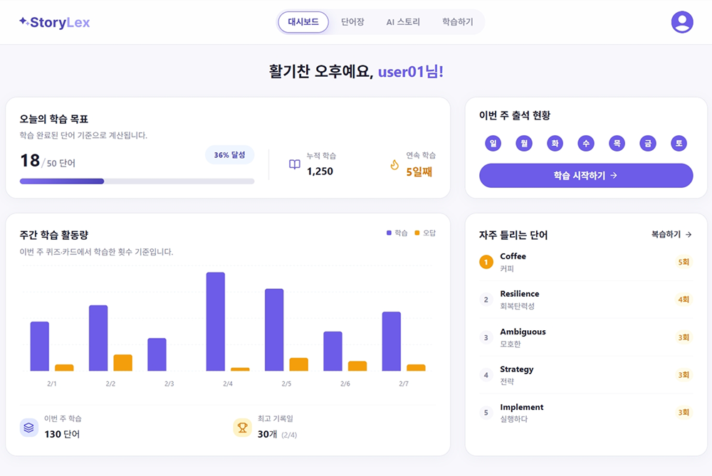
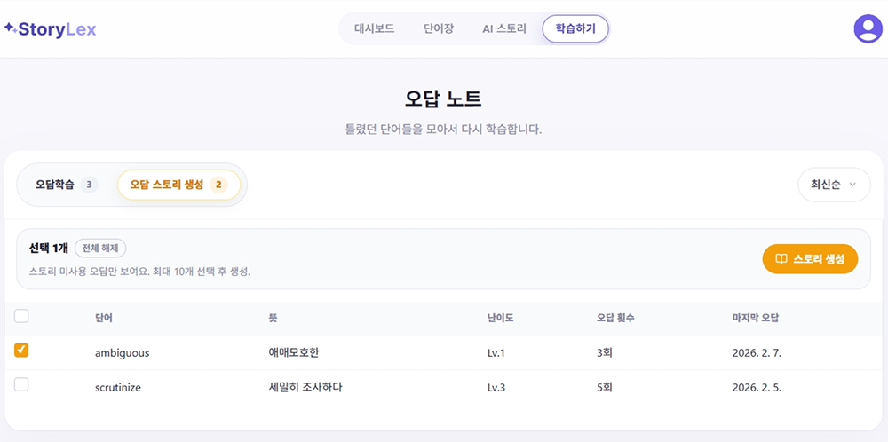
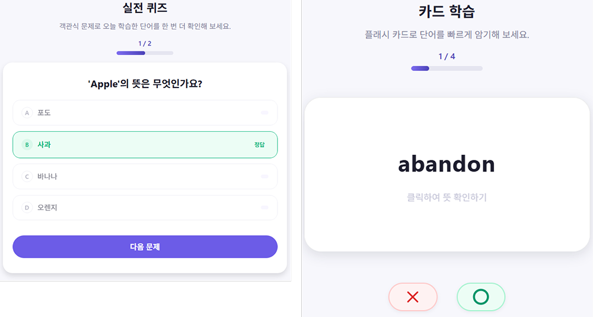

# StoryLex
> **오답 데이터 기반의 학습 흐름을 끊김 없이 연결한 영어 학습 웹 애플리케이션**

**인증 토큰 만료(401) 시 발생하는 동시 다발적인 요청 실패**를 방어하고,  
사용자 경험(UX)이 중단되지 않도록 **네트워크 레벨에서 안정성**을 확보하는 데 집중했습니다.

---

## 🔐 Core Engineering: 인증 동시성 제어
이 프로젝트의 가장 큰 기술적 도전은 **토큰 만료(401) 시점에 여러 API가 동시에 호출될 때**,
중복된 Refresh 요청으로 인해 인증이 풀리거나 무한 루프에 빠지는 **Race Condition** 문제였습니다.

이를 해결하기 위해 **요청을 큐(Queue)에 잠시 대기시키는 'Axios Interceptor' 전략**을 도입했습니다.

### 1. The Problem (Race Condition)
- 액세스 토큰 만료 시, 대시보드/단어장 등에서 동시 다발적인 API 요청 발생
- 각 요청이 개별적으로 Refresh를 시도하여 **서버 부하 및 인증 상태 불일치** 발생

### 2. The Solution (Queueing & Centralization)
- **Concurrency Control:** Refresh가 진행 중일 때 들어오는 요청은 **`Promise` 객체로 큐에 적재**
- **Sequential Execution:** 토큰 갱신 성공 후, 대기 중이던 요청을 **새로운 토큰으로 재시도(Retry)**
- **Result:** 인증 로직을 UI 컴포넌트에서 완전히 분리하고, **네트워크 레이어로 중앙화**

---

## 🔄 Data Flow & Architecture
**데이터의 성격(Server vs Client)** 에 따라 상태 관리 도구를 명확히 분리하여 데이터 무결성을 유지했습니다.

- **Server State (TanStack Query):**
  - 단어, 학습 기록 등 비즈니스 데이터 캐싱
  - `Invalidate Queries`를 활용해 학습 완료 시 대시보드 데이터 자동 동기화
- **Client State (Zustand):**
  - 인증 세션, 다크 모드, 학습 필터 등 전역 UI 상태 관리
- **Normalize Layer:**
  - 백엔드 응답 필드명이 변경되더라도 UI 코드가 영향을 받지 않도록 **데이터 정규화 계층**을 도입

---

## 🛠 Tech Stack
- **Core:** React, Vite, JavaScript
- **State:** TanStack Query v5, Zustand
- **Network:** Axios (Interceptor)
- **Routing:** React Router DOM
- **Mock:** MSW

---

## 📱 Preview

### Dashboard — 학습 현황 & 서버 상태
- React Query 기반 캐싱된 학습 데이터
- 학습 완료 시 invalidate로 자동 갱신



### Wrong Note — 오답 중심 데이터 흐름
- 오답 누적 → 선택 → 재학습/AI 스토리로 연결
- Normalize Layer 기반 일관된 데이터 구조



### Learning — UX 끊김 없는 학습 플로우
- 퀴즈 / 플래시카드 전환
- 인증/네트워크 실패 시에도 화면 유지



---

## Run
```bash
# 1. Install dependencies
npm ci

# 2. Run development server
npm run dev

